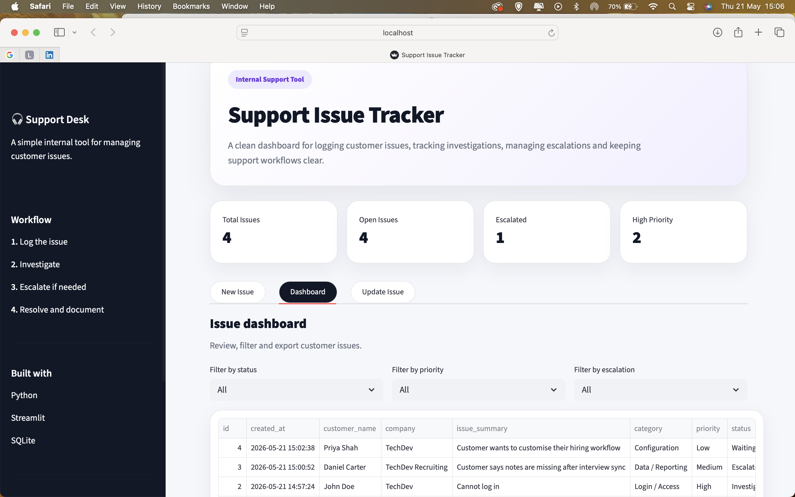
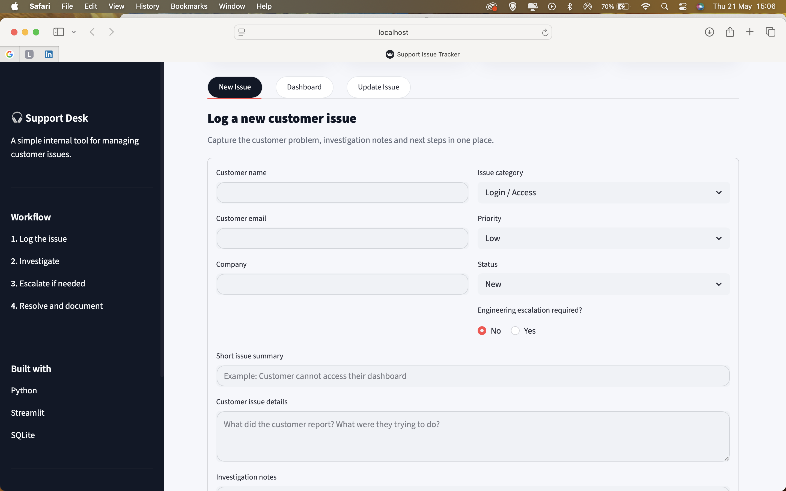
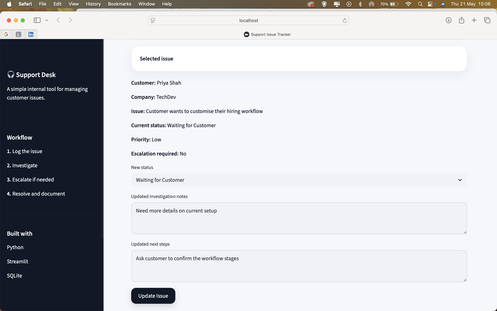

# SaaS Support Issue Tracker

A simple internal support tool built with Python, Streamlit and SQLite.

## Overview

This project is a beginner-friendly support issue tracker designed to simulate how a SaaS support team logs, investigates and manages customer issues.

It allows a support agent to capture customer issues, categorise them, track priority and status, add investigation notes, mark whether escalation is needed and review issues in a simple dashboard.

## Screenshots

### Dashboard

### New Issue Form

### Update Issue

## Why I Built This

I built this project to practise technical support workflows used in SaaS companies, including issue triage, documentation, escalation handling and basic database use.

As I transition from healthcare technology into SaaS technical support, I wanted to create a practical project that reflects how support teams investigate unclear customer issues, document findings and improve support processes.

## Features

- Log new customer issues
- Add customer name, email and company
- Categorise issues by type
- Set priority and status
- Mark whether engineering escalation is required
- Add investigation notes and next steps
- View issues in a dashboard
- Filter issues by status, priority and escalation
- Update existing issues
- Download issues as a CSV file
- Store issue data in a SQLite database

## Skills Demonstrated

- Python
- Streamlit
- SQLite
- SQL basics
- Technical support workflows
- Issue triage
- Documentation
- Escalation handling
- Customer support operations
- Building simple internal tools

## Example Use Case

A customer reports that interview notes are not appearing after a sync. The support agent logs the issue, adds the customer details, categorises it as Data / Reporting, marks it as escalated, documents the investigation notes and records the next steps for engineering.

## What I Learned

This project helped me understand how internal support tools can make issue tracking clearer and more structured. It also helped me practise writing cleaner documentation, thinking through support workflows and using a database to store customer issue records.

## Future Improvements

- Add user login
- Add search by customer or company
- Add charts for issue trends
- Add status change history
- Add AI-generated issue summaries
- Add fake logs for technical investigation practice
- Add engineering escalation templates
- Deploy the app online using Streamlit Community Cloud